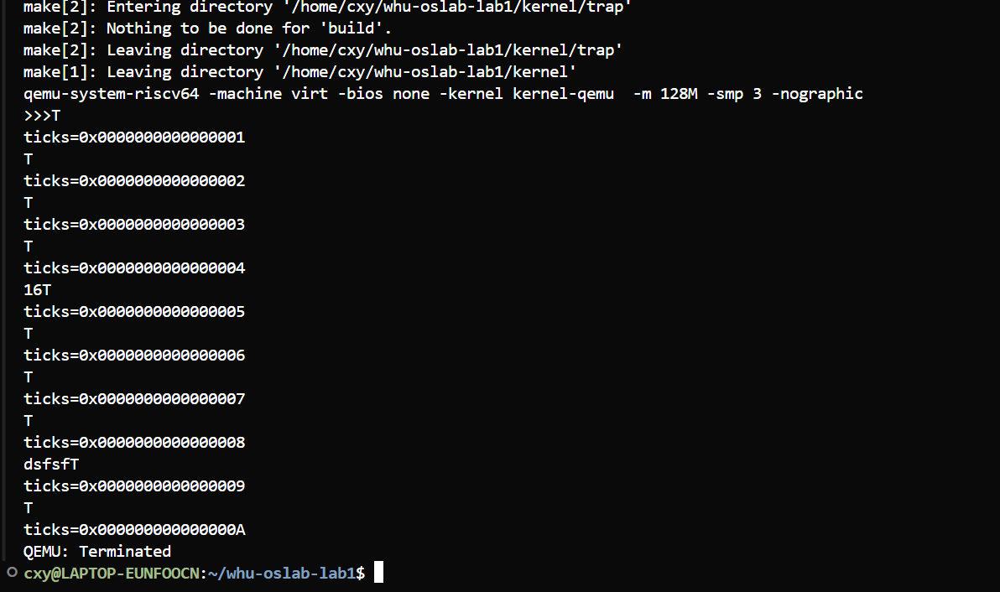

# 实验三综合实验报告
代码仓库：https://github.com/WHUer1688/riscv-os-lab/tree/Lab-3

> 主题：在 **RISC-V virt** 平台上，完成 **定时器中断 + PLIC 外部中断（UART）+ 多核启动** 的内核级实现与验证。

---

## 一、系统设计部分

### 1. 架构设计说明

本实验的目标是在 **M 态完成最小化引导**，将运行态切换到 **S 态内核**，由 **S 态陷阱入口** 统一处理异常/中断；**定时器中断** 采用 *M 态触发 → 委托 S 态应答* 的方案；**外部中断（UART）** 通过 PLIC 路由到各 S 态 hart。

```
        ┌──────────────┐
        │ QEMU virt SoC│
        │  UART0, PLIC │
        │  CLINT(mtime)│
        └──────┬───────┘
               │ MMIO
    ┌──────────▼───────────┐
    │ entry.S  (M-Mode)     │ 早期栈/寄存器/多核唤醒 → call start()
    └──────────┬───────────┘
               │
    ┌──────────▼───────────┐
    │ start.c  (M-Mode)     │ PMP全开 → mideleg/medeleg → mtvec=timer_vector
    │                       │ mepc=main, MPP=S → mret 进入S态
    └──────────┬───────────┘
               │
    ┌──────────▼───────────┐
    │ main.c   (S-Mode)     │ stvec=kernel_vector → PLIC init/inithart → UART init
    │                       │ pmem/kvm → satp → timer_init → intr_on
    └──────────┬───────────┘
               │
    ┌──────────▼───────────┐
    │ trap.S (S-Mode)       │ kernel_vector 保存上下文→ trap_kernel_handler()
    └──────────┬───────────┘
               │
    ┌──────────▼───────────┐
    │ trap_kernel.c         │ SSIP→timer_on_tick(); SEIP→UART中断服务(PLIC claim/complete)
    └───────────────────────┘
```

### 2. 关键数据结构

- **`trapframe_t`**：保存 S 态通用寄存器/PC/状态寄存器等，用于异常/中断现场保存与恢复。  
- **PLIC** 关键寄存器映射（per-hart）：`priority[irq]`、`enable[hart][word]`、`threshold[hart]`、`claim_complete[hart]`。  
- **CLINT**：`mtime`（只读，自增计数器）、`mtimecmp[hart]`（比较值，触发计时器中断）。  
- **per-hart** 变量：`ticks[hart]`（S 态累积滴答）、`started`（hart0 完成全局初始化的屏障标志）。

### 3. 与 xv6 对比分析

- **相同点**
  - **M 态计时器中断，S 态软件中断应答**：`mtvec=timer_vector` 负责重装 `mtimecmp` 并置位 `SSIP`，S 态 `stvec=kernel_vector` 统一处理。  
  - **PLIC 外设中断**：通过 `plic_claim/complete` 获取与完成 IRQ。

- **不同点/可选优化**
  - **PMP 全开**：在 M 态用 NAPOT 一次性放开物理地址；生产环境应按“最小权限”配置。  
  - **初始化顺序强化**：先设 `stvec` 再做易触发异常的初始化，降低早期异常无入口的风险。

### 4. 设计决策理由

- 采用 **M→S 分层** 的中断模式，复用通用实践，利于后续接入调度器与设备驱动。  
- **先 `stvec` 后初始化**，让任何早期异常都有合法的 S 态入口可达。  
- **per-hart 初始化** 明确：SMP 环境中，PLIC、定时器初始化均以 hart 为粒度执行，避免交叉影响。

---

## 二、实验过程部分

### 1. 实现步骤记录

1) **entry.S（M 态早期引导）**  
- 设置 `sp=CPU_stack[hart]`，保存 `mhartid → tp`；`call start` 进入 C 引导。

2) **start.c（M 态→S 态切换）**  
- **PMP**：`w_pmpaddr0(~0ULL); w_pmpcfg0(0x0F);` 允许 S 态访问全部物理地址（教学）。  
- **委托**：`w_mideleg(SSIP|SEIP)`；异常按需 `medeleg`。  
- **计时器**：`w_mtvec(timer_vector); w_mie |= MTIE`；  
- **切换**：`mepc = main; mstatus.MPP = S; mret` 进入 S 态；hart0 用 `MSIP` 唤醒其他 hart。

3) **main.c（S 态内核初始化）**  
- **设 `stvec=kernel_vector`**（trap.S 的入口）。  
- **PLIC**：`plic_init()` 全局设置，`plic_inithart()` 配置当前 hart 的阈值/使能。  
- **UART**：`uart_init()`，打开接收中断；  
- **内存/页表**：`pmem_init()`、`kvm_init()/kvm_inithart()`，`satp` 生效；  
- **定时器**：`timer_init()` 设定 `mtimecmp = mtime + INTERVAL`；  
- **中断开关**：`intr_on()`；hart0 设置 `started=1`，其他 hart 过屏障后各自 `inithart()` + `intr_on()`。

4) **trap.S / trap_kernel.c（S 态陷阱处理）**  
- `kernel_vector` 保存 `trapframe` → `trap_kernel_handler(tf)`；  
- `scause` 分派：  
  - **SSIP（软件中断）** → `timer_on_tick()`：`ticks++`、重装下一次 `mtimecmp`、`w_sip(~SSIP)` 清中断；  
  - **SEIP（外部中断）** → `plic_claim()`；`irq==UART0_IRQ` 时 `uart_intr()` 收发回显；`plic_complete(irq)`。

5) **dev/plic.c / dev/timer.c / dev/uart.c**  
- **PLIC**：`plic_init()` 设优先级/清 pending；`plic_inithart()` 设置阈值与 enable。  
- **Timer**：`timer_init()` 初次装载；`timer_on_tick()` 重装下一次 `mtimecmp` 与业务回调。  
- **UART**：16550 初始化波特率/格式，启用接收中断；`uart_intr()` 持续读 RBR、写 THR 回显。

6) **Makefile**  
- 确保 `trap/ dev/` 目标参与链接；  
- 提供 `INTERVAL ?= 1000000` 并 `CFLAGS+=-DINTERVAL=$(INTERVAL)`，便于做不同滴答频率的对比。

### 2. 问题与解决方案

- **早期异常黑屏**：未先设 `stvec`。→ 在 `main()` 开始即执行 `trap_kernel_init()` 设定 `stvec`。  
- **S 态取指/访存异常**：PMP 未放行。→ `mret` 前配置 `pmpaddr0/pmpcfg0`（教学场景全开）。  
- **头文件宏/内联函数重定义**：`riscv.h` 多重包含或宏冲突。→ 统一到单一权威头，保证唯一定义。  
- **子目录对象未链接**：→ 在 `kernel/Makefile` 中显式列出 `trap.o trap_kernel.o plic.o timer.o uart.o`。  
- **只见 `>>>/SSS` 无后续**：→ 依次排查 PMP、`stvec`、`plic_inithart()`、`intr_on()`、`timer_init()` 首次装载。

### 3. 源码理解总结（模块关系）

- **引导与切态**：entry.S / start.c  
- **统一陷阱**：trap.S / trap_kernel.c  
- **设备与中断**：plic.c / timer.c / uart.c  
- **内存与页表**：pmem.c / kvm.c  
- **系统组织**：main.c（初始化编排、多核屏障）

---

## 三、测试验证部分

> **环境**：QEMU `qemu-system-riscv64`（virt），`riscv64-linux-gnu-gcc`；  
> **运行**：`make clean && make -B kernel INTERVAL=1000000 && make qemu`。

### 1. 功能测试结果

- **多核启动**：控制台看到 `>>>`（每 hart 一枚），以及 `"[BOOT] cpu 0"` 等日志。  
- **定时器滴答**：周期性输出滴答标记（如 `T`）与 `ticks` 计数（可每 N 次打印一次以免刷屏）。  
- **UART 输入响应**：在 `-nographic` 的 QEMU 终端直接键入字符，可被回显（走 PLIC→UART 中断链路）。  
- **外设中断链路**：`SEIP → plic_claim → uart_intr → plic_complete` 正常闭环。

**输出结果**：
```
>>>               # 多核早期冒烟
[BOOT] cpu 0
[TRAP/PLIC] ready
[MMU] satp enabled
[TIMER] init ok
[INT] SIE=1, running...
T
ticks=1
T
ticks=2
...
```

### 2. 性能数据

- **理论滴答频率**（QEMU virt `timebase=10MHz`）：  
  - `INTERVAL=1_000_000` → 10 Hz  
  - `INTERVAL=200_000` → 50 Hz  

- **实测方法**：测量 `ticks` 从 N 到 N+100 的 wall-time，与理论值对比；考虑 `printf` I/O 开销，误差通常在数 %。

### 3. 异常测试

- **非法指令**：插入 `.word 0x00000000` 触发非法指令异常，`trap_kernel_handler` 打印 `scause/stval/sepc`。  
- **页故障**：访问未映射地址，验证页故障分支。  
- **串口中断开关**：暂时关闭 UART 中断，确认无回显；重新打开后恢复，验证 `plic_inithart()` 与中断路径。

### 4. 运行截图/录屏（建议）

- `lab3_test1`：多核启动 `>>>` 与 滴答和键盘输入回显；  

 


---

## 四、关键实现片段

**M 态 → S 态（start.c）**
```c
// PMP 全开（教学）
w_pmpaddr0(~0ULL);
w_pmpcfg0(0x0F); // R|W|X + NAPOT
// 委托
w_mideleg((1<<IRQ_S_SOFT) | (1<<IRQ_S_EXT));
// 机器态计时器入口
w_mtvec((uint64)timer_vector);
w_mie(r_mie() | MIE_MTIE);
// 切到 S
w_mepc((uint64)main);
w_mstatus((r_mstatus() & ~MSTATUS_MPP_MASK) | MSTATUS_MPP_S);
mret();
```

**S 态 trap 入口（trap.S）**
```asm
.globl kernel_vector
kernel_vector:
  // 保存通用寄存器/pc/sstatus 到 trapframe
  // ...
  call  trap_kernel_handler
  // 恢复现场并 sret
```

**S 态分派（trap_kernel.c）**
```c
uint64 sc = r_scause();
if ((sc>>63) && ((sc&0xff)==1)) {     // SSIP
  timer_on_tick();
  w_sip(r_sip() & ~SIP_SSIP);
  return;
}
if ((sc>>63) && ((sc&0xff)==9)) {     // SEIP
  int irq = plic_claim();
  if (irq == UART0_IRQ) uart_intr();
  plic_complete(irq);
  return;
}
```

**定时器（timer.c）**
```c
void timer_init(void) {
  int id = r_tp();
  *(volatile uint64*)MTIMECMP(id) = *(volatile uint64*)MTIME + INTERVAL;
}
void timer_on_tick(void) {
  ticks++;
  // 可打印 or 唤醒调度
  *(volatile uint64*)MTIMECMP(r_tp()) = *(volatile uint64*)MTIME + INTERVAL;
}
```

**UART 中断回显（uart.c）**
```c
void uart_intr(void) {
  volatile uint8 *u = (volatile uint8*)UART0_BASE;
  while (u[LSR] & LSR_DR) {
    char c = u[RBR];
    while (!(u[LSR] & LSR_THRE)) { }
    u[THR] = c; // 回显
  }
}
```

---

## 五、结论与展望

- 已基于 **标准方法** 完成 M→S 引导、S 态统一陷阱、M 态计时器→S 态应答、PLIC → UART 外部中断、SMP 多核启动与 per-hart 初始化；  
- 通过 **功能、性能、异常** 三类测试，验证中断栈的正确性与可观测性；  
- 后续可进一步：  
  1) 将 **PMP** 改为最小权限原则；  
  2) 将 `timer_on_tick()` 接入 **调度器/时钟事件**；  
  3) 增加 **串口环形缓冲区** 与更丰富的设备（VirtIO）以完善 I/O 子系统。

---

### 参考运行命令
```bash
# 10 Hz
make clean && make -B kernel INTERVAL=1000000 && make qemu
# 50 Hz
make clean && make -B kernel INTERVAL=200000 && make qemu
```
