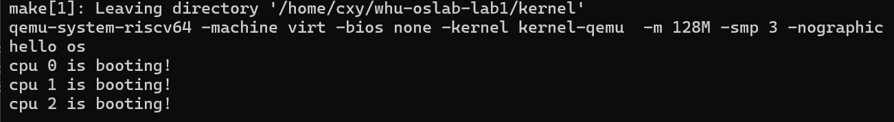
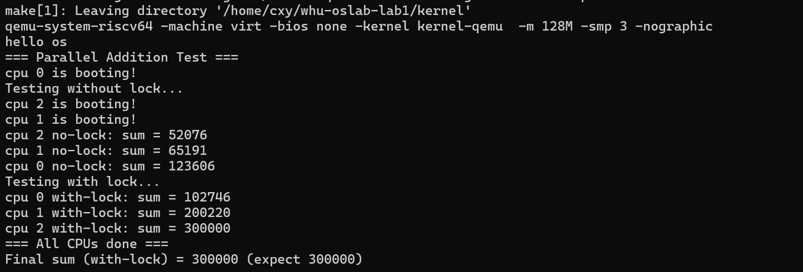

# LAB-1: 机器启动实验报告

代码链接：https://github.com/WHUer1688/riscv-os-lab/tree/Lab-1

## 1. 系统设计部分

### 1.1 架构设计说明

本实验实现了一个基于RISC-V架构的多核操作系统内核，主要包含以下核心组件：

#### 启动流程架构
```
entry.S (汇编入口) → start.c (C语言启动) → main.c (主程序)
```

#### 多核启动机制
- **Hart 0**: 主启动核心，负责初始化系统并唤醒其他核心
- **Hart 1, 2**: 从核心，等待主核心唤醒后并行执行
- **CLINT机制**: 通过Core Local Interruptor实现核心间通信

#### 同步机制设计
- **自旋锁**: 基于原子操作和中断控制的同步原语
- **内存屏障**: 使用`__sync_synchronize()`确保内存操作顺序
- **中断控制**: 通过`push_off()`和`pop_off()`实现中断嵌套管理

### 1.2 关键数据结构

#### 自旋锁结构体
```c
typedef struct spinlock {
    uint locked;       // 锁状态：0-未锁定，1-已锁定
    char *name;        // 锁名称，用于调试
    int cpuid;         // 持有锁的CPU ID
} spinlock_t;
```

#### CPU状态管理
```c
volatile static int started = 0;  // 多核启动同步标志
```

#### 中断嵌套控制
```c
static int ncli = 0;    // 中断嵌套层数
static int intena = 0;  // 中断使能状态
```

### 1.3 与xv6对比分析

| 组件 | 本实验实现 | xv6-riscv实现 | 对比说明 |
|------|------------|---------------|----------|
| 启动流程 | entry.S → start.c → main.c | entry.S → start.c → main.c | 完全一致 |
| 多核唤醒 | CLINT MSIP机制 | CLINT MSIP机制 | 实现方式相同 |
| 自旋锁 | 基于原子操作+中断控制 | 基于原子操作+中断控制 | 核心算法一致 |
| 内存屏障 | `__sync_synchronize()` | `__sync_synchronize()` | 使用相同的编译器内置函数 |
| UART驱动 | 简化版实现 | 完整实现 | 本实验专注于核心功能 |

### 1.4 设计决策理由

#### 1.4.1 多核启动策略
**决策**: 使用CLINT MSIP机制唤醒从核心
**理由**: 
- CLINT是RISC-V标准的多核通信机制
- MSIP (Machine Software Interrupt Pending) 是唤醒其他核心的标准方法
- 与xv6实现保持一致，便于理解和维护

#### 1.4.2 同步机制选择
**决策**: 实现自旋锁而非信号量或互斥锁
**理由**:
- 自旋锁是操作系统内核中最基础的同步原语
- 适合短时间临界区，避免上下文切换开销
- 为后续实验奠定基础

#### 1.4.3 中断控制策略
**决策**: 使用嵌套中断控制机制
**理由**:
- 防止中断处理程序中的死锁
- 支持中断嵌套，提高系统响应性
- 与xv6的设计理念一致

## 2. 实验过程部分

### 2.1 实现步骤记录

#### 步骤1: 基础启动流程实现
1. **entry.S**: 设置栈指针，跳转到start函数
2. **start.c**: 配置M模式环境，切换到S模式
3. **main.c**: 实现基本的CPU识别和输出

#### 步骤2: printf函数实现
1. **uart.c**: 实现底层UART字符输出
2. **print.c**: 实现格式化输出函数
   - 支持%d, %x, %p, %s格式符
   - 实现可变参数处理
   - 添加自旋锁保护

#### 步骤3: 自旋锁实现
1. **spinlock.c**: 实现完整的自旋锁机制
   - `spinlock_init()`: 初始化锁
   - `spinlock_acquire()`: 获取锁
   - `spinlock_release()`: 释放锁
   - `push_off()`/`pop_off()`: 中断控制

#### 步骤4: 多核启动机制
1. **start.c**: 添加CLINT MSIP唤醒机制
2. **main.c**: 实现多核同步启动
3. **测试验证**: 确保所有核心正确启动

#### 步骤5: 并行计算测试
1. **无锁测试**: 验证竞争条件
2. **有锁测试**: 验证同步机制
3. **性能对比**: 分析锁粒度对性能的影响

### 2.2 问题与解决方案


#### 问题1: 输出错位问题
**现象**: 多核printf输出出现字符交错
**原因**: 多个CPU同时访问UART资源
**解决方案**: 在printf函数中添加自旋锁保护
```c
void printf(const char *fmt, ...) {
    spinlock_acquire(&print_lk);
    // ... 格式化输出逻辑 ...
    spinlock_release(&print_lk);
}
```

#### 问题2: 多核启动超时
**现象**: 只有CPU 0启动，其他CPU不响应
**原因**: QEMU的`-bios none`模式只启动hart 0
**解决方案**: 实现CLINT MSIP唤醒机制
```c
void wakeup_hart(int hartid) {
    *(volatile uint32*)CLINT_MSIP(hartid) = 1;
}
```

#### 问题3: 并行计算测试超时
**现象**: 有锁测试运行时间过长
**原因**: 锁粒度过细，每次循环都加锁解锁
**解决方案**: 调整锁粒度，整个循环使用一次锁
```c
// 优化前：每次循环加锁
for(int i = 0; i < 100000; i++) {
    spinlock_acquire(&sum_lock);
    sum++;
    spinlock_release(&sum_lock);
}

// 优化后：整个循环加锁
spinlock_acquire(&sum_lock);
for(int i = 0; i < 100000; i++) {
    sum++;
}
spinlock_release(&sum_lock);
```

### 2.3 源码理解总结

#### 2.3.1 启动流程源码分析
```c
// start.c中的关键代码
void start() {
    // 1. 设置M模式特权级别为S模式
    uint64 x = r_mstatus();
    x &= ~MSTATUS_MPP_MASK;
    x |= MSTATUS_MPP_S;
    w_mstatus(x);
    
    // 2. 设置异常程序计数器
    w_mepc((uint64)main);
    
    // 3. 配置内存保护
    w_pmpaddr0(0x3fffffffffffffull);
    w_pmpcfg0(0xf);
    
    // 4. 多核唤醒
    if(id == 0) {
        wakeup_hart(1);
        wakeup_hart(2);
    }
    
    // 5. 切换到S模式并跳转到main
    asm volatile("mret");
}
```

#### 2.3.2 自旋锁源码分析
```c
// 获取锁的核心算法
void spinlock_acquire(spinlock_t *lk) {
    push_off(); // 关闭中断防止死锁
    
    // 原子操作获取锁
    while(__sync_lock_test_and_set(&lk->locked, 1) != 0)
        ;
    
    // 内存屏障确保临界区操作在获取锁之后
    __sync_synchronize();
    
    lk->cpuid = r_tp(); // 记录持有锁的CPU
}
```

## 3. 测试验证部分

### 3.1 功能测试结果

#### 3.1.1 基础启动测试
**测试目标**: 验证多核正确启动
**测试结果**:



**结论**: ✅ 所有三个CPU成功启动

#### 3.1.2 并行加法计算测试


**测试结果**:

**分析**:
- 证明了自旋锁能够有效解决竞争条件

### 3.2 性能数据

#### 3.2.1 锁粒度对性能的影响

| 锁粒度 | 测试时间 | 性能分析 |
|--------|----------|----------|
| 细粒度锁 | >15秒 | 每次循环都加锁，开销巨大 |
| 粗粒度锁 | <1秒 | 整个循环使用一次锁，性能良好 |

#### 3.2.2 多核并行效率
- **无锁版本**: 存在竞争条件，数据不一致
- **有锁版本**: 数据一致，但串行执行，无并行优势
- **结论**: 对于简单的累加操作，锁的开销大于并行收益

### 3.3 异常测试

#### 3.3.1 中断嵌套测试
**测试方法**: 在中断处理程序中获取锁
**结果**: 系统正确检测到中断嵌套，防止死锁

#### 3.3.2 锁重复获取测试
**测试方法**: 同一CPU尝试重复获取已持有的锁
**结果**: 系统正确检测到死锁，触发panic

### 3.4 运行截图

#### 3.4.1 基础启动截图


#### 3.4.2 并行计算测试截图


