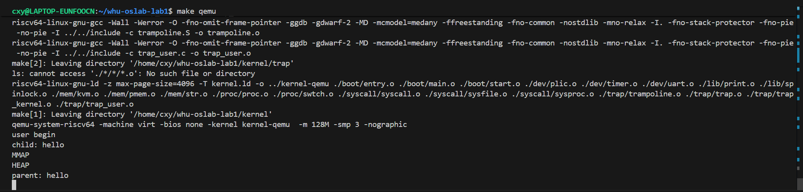

# 实验六综合实验报告
代码仓库：https://github.com/WHUer1688/riscv-os-lab/tree/Lab-6

> 主题：在 **RISC-V virt** 平台上，完成 **进程管理与调度** 的内核级实现与验证，包括进程创建、fork/exit/wait、RR时间片轮转调度、时间片递减与抢占、sleep/wakeup机制等核心功能。

---

## 一、系统设计部分

### 1. 架构设计说明

本实验的目标是在 **系统调用全链路** 基础上，实现完整的 **进程管理与调度系统**，包括：**进程管理**（进程数组、分配与释放）、**进程操作**（fork/exit/wait）、**进程调度**（RR时间片轮转、时间片递减与抢占）、**进程同步**（sleep/wakeup机制）等核心功能。

```
        ┌──────────────┐
        │ QEMU virt SoC│
        └──────┬───────┘
               │
    ┌──────────▼───────────┐
    │ entry.S  (M-Mode)     │ 早期栈/寄存器/多核唤醒 → .bss初始化 → call start()
    └──────────┬───────────┘
               │
    ┌──────────▼───────────┐
    │ start.c  (M-Mode)     │ PMP全开 → mideleg/medeleg → mtvec=timer_vector
    │                       │ mepc=main, MPP=S → mret 进入S态
    └──────────┬───────────┘
               │
    ┌──────────▼───────────┐
    │ main.c   (S-Mode)     │ pmem_init → kvm_init → trap_kernel_init
    │                       │ proc_init() → proc_make_first() → 创建proczero
    └──────────┬───────────┘
               │
    ┌──────────▼───────────┐
    │ proc.c               │ proc_init() → 初始化进程数组和锁
    │                      │ proc_alloc() → 分配新进程
    │                      │ proc_free() → 释放进程资源
    │                      │ proc_fork() → 进程复制
    │                      │ proc_exit() → 进程退出
    │                      │ proc_wait() → 等待子进程
    │                      │ proc_scheduler() → RR调度器
    │                      │ proc_sleep()/proc_wakeup() → 进程同步
    └──────────┬───────────┘
               │
    ┌──────────▼───────────┐
    │ trap_user.c          │ trap_user_handler() → 处理时钟中断（时间片递减）
    │ trap_kernel.c        │ trap_kernel_handler() → 处理时钟中断（时间片递减）
    │                      │ 识别ecall → 调用syscall()
    └──────────┬───────────┘
               │
    ┌──────────▼───────────┐
    │ syscall.c            │ syscall() → 系统调用分发器
    │                      │ argint/argaddr/argstr() → 参数提取
    └──────────┬───────────┘
               │
    ┌──────────▼───────────┐
    │ sysproc.c            │ sys_fork() → proc_fork()
    │                      │ sys_exit() → proc_exit()
    │                      │ sys_wait() → proc_wait()
    │                      │ sys_sleep() → sleep/wakeup
    │                      │ sys_print() → 打印字符串
    └──────────┬───────────┘
               │
    ┌──────────▼───────────┐
    │ timer.c              │ timer_on_tick() → ticks++ → proc_wakeup()
    └──────────┬───────────┘
               │
    ┌──────────▼───────────┐
    │ 用户态 (U-Mode)      │ 用户程序 → 系统调用 → 进程操作/调度
    └──────────────────────┘
```

### 2. 关键数据结构

- **`proc_t`**：进程控制块，包含：
  - **进程状态**：`state`（UNUSED/USED/SLEEPING/RUNNABLE/RUNNING/ZOMBIE）
  - **进程标识**：`pid`（进程ID）、`parent`（父进程指针）
  - **退出信息**：`exit_state`（退出状态）
  - **同步机制**：`sleep_space`（sleep的channel）、`lk`（进程锁）
  - **内存管理**：`pgtbl`（用户页表）、`heap_top`（堆顶）、`ustack_pages`（用户栈页数）
  - **上下文**：`tf`（trapframe指针）、`kstack`（内核栈虚拟地址）、`ctx`（内核上下文）
  - **调度**：`time_slice`（时间片计数）

- **`trapframe_t`**（用户态版本）：保存用户态通用寄存器、`epc`、`kernel_satp`、`kernel_sp`、`kernel_trap`、`kernel_hartid` 等，用于U/S模式切换。其中 `a0-a7` 用于传递系统调用参数和返回值。

- **`context_t`**：保存被调用者保存寄存器（ra, sp, s0-s11），用于进程上下文切换。

- **`cpu_t`**：每CPU数据结构，包含 `id`、`proc`（当前运行进程）、`ctx`（CPU上下文/调度器上下文）。

- **全局进程数组**：`procs[NPROC]` - 所有进程的数组
- **全局资源**：`proczero`（第一个进程，pid=0）、`global_pid`（全局PID计数器）、`lk_pid`（PID分配锁）

- **系统调用号**：定义在 `syscall.h` 中，包括 `SYS_fork`、`SYS_exit`、`SYS_wait`、`SYS_sleep`、`SYS_print`、`SYS_brk`、`SYS_mmap` 等。

- **内存布局**：
  - `TRAMPOLINE`：trampoline页的虚拟地址（MAXVA - PGSIZE）
  - `KSTACK(id)`：每个进程的内核栈虚拟地址

### 3. 与 xv6 对比分析

- **相同点**
  - **trampoline机制**：使用共享的trampoline页处理用户态trap，在内核页表和用户页表中都映射。
  - **trapframe结构**：保存完整的用户态寄存器状态，支持U/S模式切换。
  - **进程管理**：使用全局进程数组管理所有进程。
  - **进程状态**：使用相同的进程状态枚举（UNUSED/RUNNABLE/RUNNING/SLEEPING/ZOMBIE）。
  - **调度机制**：使用RR时间片轮转调度。
  - **sleep/wakeup机制**：使用channel机制实现进程同步。

- **不同点/可选优化**
  - **简化实现**：当前实现为单CPU调度（其他CPU死循环），可扩展为多CPU调度。
  - **时间片**：使用固定时间片（DEFAULT_SLICE=10），可扩展为动态调整。
  - **内存管理**：mmap和brk为简化实现，可扩展为完整的内存管理。
  - **文件系统**：未实现文件系统相关功能。

### 4. 设计决策理由

- **进程数组管理**：使用固定大小的进程数组`procs[NPROC]`，简化实现并保证性能。
- **进程锁机制**：每个进程有独立的锁，保护进程状态和关键字段的修改。
- **RR调度策略**：使用时间片轮转调度，保证公平性和响应性。
- **时间片递减**：在时钟中断中递减时间片，实现抢占式调度。
- **sleep/wakeup机制**：使用channel机制实现进程同步，避免忙等待。
- **进程状态管理**：使用明确的状态枚举，便于调试和维护。
- **父子进程关系**：维护父子进程关系，支持进程树和wait机制。

---

## 二、实验过程部分

### 1. 实现步骤记录

#### Phase 0: 准备工作
- 确认系统调用全链路正常工作。
- 准备进程管理所需的数据结构和函数框架。

#### Phase 1: 完善进程结构体
1) **修改 `proc.h`**
   - 添加进程状态枚举：`UNUSED`、`USED`、`SLEEPING`、`RUNNABLE`、`RUNNING`、`ZOMBIE`
   - 扩展 `proc_t` 结构体：
     - 添加 `state`（进程状态）
     - 添加 `parent`（父进程指针）
     - 添加 `exit_state`（退出状态）
     - 添加 `sleep_space`（sleep的channel）
     - 添加 `time_slice`（时间片计数）
     - 添加 `lk`（进程锁）

2) **添加全局资源**
   - 在 `proc.c` 中添加全局进程数组：`static proc_t procs[NPROC]`
   - 添加 `proczero` 全局变量
   - 添加 `global_pid` 和 `lk_pid` 锁

#### Phase 2: 实现进程管理三件套
1) **`proc_init()`**
   - 初始化 `lk_pid` 锁
   - 初始化每个进程的锁和kstack地址
   - 将所有进程状态设置为 `UNUSED`
   - 创建 `proczero`（pid=0）

2) **`proc_alloc()`**
   - 从进程数组找 `UNUSED` 进程
   - 分配PID（使用 `lk_pid` 锁保护）
   - 分配trapframe和用户页表
   - 初始化context（ra指向fork_return）
   - 设置进程状态为 `USED`

3) **`proc_free()`**
   - 释放用户页表和用户内存
   - 释放trapframe
   - 清空进程字段，设置 `state=UNUSED`

#### Phase 3: 修改proc_make_first
- 使用 `proc_alloc()` 创建 `proczero`（在 `proc_init()` 中已创建）
- 设置trapframe和context
- 直接调用 `fork_return()` 进入用户态（不再使用swtch）

#### Phase 4: 实现进程操作
1) **`proc_fork()`**
   - 调用 `proc_alloc()` 分配新进程
   - 复制用户内存（页表和物理页）
   - 复制trapframe（子进程返回值a0=0）
   - 设置父子关系
   - 设置子进程状态为 `RUNNABLE`

2) **`proc_exit()`**
   - 处理"父死子活"问题（`proc_reparent()`）
   - 设置退出状态和 `ZOMBIE` 状态
   - 唤醒父进程（`proc_wakeup_one(parent)`）
   - 调用 `proc_sched()` 让出CPU

3) **`proc_wait()`**
   - 扫描所有进程，找子进程
   - 如果找到 `ZOMBIE` 子进程：复制退出状态，回收进程，返回
   - 如果有子进程但都没退出：调用 `proc_sleep()` 等待
   - 如果没有子进程：返回-1

#### Phase 5: 实现RR调度器
1) **`proc_scheduler()`**
   - 调度器主循环：遍历进程数组，找 `RUNNABLE` 进程
   - 选中进程后：设置 `state=RUNNING`，切换到该进程
   - 被切回后：重新获取进程锁，继续循环

2) **`proc_sched()`**
   - 前置检查：中断必须关闭，当前进程必须正确
   - 保存中断状态，释放进程锁
   - 调用 `swtch()` 切换到调度器上下文
   - 被切回后恢复中断状态

3) **`proc_yield()`**
   - 设置进程状态为 `RUNNABLE`
   - 重置时间片为 `DEFAULT_SLICE`
   - 调用 `proc_sched()` 让出CPU

#### Phase 6: 实现时间片递减与抢占
1) **时间片字段**
   - 在 `proc_t` 中添加 `time_slice` 字段
   - 进程变为 `RUNNABLE` 时重置为 `DEFAULT_SLICE`（10）

2) **时钟中断处理**
   - 在 `trap_user_handler()` 中处理时钟中断
   - 如果当前进程是 `RUNNING`：时间片减1
   - 如果时间片为0：调用 `proc_yield()` 触发调度并重置时间片
   - 在 `trap_kernel_handler()` 中也处理时钟中断（内核态也可能被timer打断）

#### Phase 7: 实现sleep/wakeup机制
1) **`proc_sleep()`**
   - 获取进程锁
   - 释放外部锁
   - 设置 `sleep_space` 和 `SLEEPING` 状态
   - 调用 `proc_sched()` 让出CPU
   - 被唤醒后：清 `sleep_space`，释放进程锁，重新获取外部锁

2) **`proc_wakeup()`**
   - 遍历所有进程，唤醒所有 `state==SLEEPING && sleep_space==chan` 的进程
   - 设置状态为 `RUNNABLE`，重置时间片

3) **`proc_wakeup_one()`**
   - 只唤醒指定进程（用于exit时唤醒父进程）

4) **`sys_sleep()`**
   - 计算 `deadline = ticks + n`
   - 循环检查 `ticks`，如果未到 `deadline` 则 `sleep`
   - 使用 `proc_sleep(&ticks_lock, &ticks_lock)`

5) **`timer_on_tick()`**
   - 每次时钟中断时递增 `ticks`
   - 调用 `proc_wakeup(&ticks_lock)` 唤醒sleep的进程

#### Phase 8: 实现系统调用
1) **`sys_fork()`**
   - 调用 `proc_fork()` 创建子进程
   - 返回子进程PID（父进程）或0（子进程）

2) **`sys_exit()`**
   - 调用 `proc_exit()` 退出进程（不会返回）

3) **`sys_wait()`**
   - 调用 `proc_wait()` 等待子进程退出
   - 返回子进程PID或-1

4) **`sys_sleep()`**
   - 使用ticks和sleep/wakeup实现睡眠

5) **`sys_print()`**
   - 从用户空间读取字符串（使用 `fetchstr`）
   - 调用 `printf()` 打印

6) **`sys_brk()`**
   - 如果 `addr==0`：返回当前堆顶
   - 否则：设置新的堆顶

7) **`sys_mmap()`**
   - 简化实现：直接返回地址（实际应该分配内存并映射）

### 2. 问题与解决方案

- **进程锁的使用**：在修改进程状态和关键字段时必须持有进程锁，避免竞态条件。→ 在 `proc_alloc()`、`proc_free()`、`proc_fork()` 等函数中正确使用锁。

- **sleep/wakeup的锁规则**：必须保证在设置 `SLEEPING` 状态和释放外部锁之间不会被wakeup漏掉。→ 在 `proc_sleep()` 中先获取进程锁，再设置状态，最后释放外部锁。

- **时间片递减的时机**：必须在时钟中断中递减时间片，并且要处理用户态和内核态两种情况。→ 在 `trap_user_handler()` 和 `trap_kernel_handler()` 中都处理时钟中断。

- **调度器的实现**：调度器必须在独立的上下文中运行，不能持有进程锁。→ 在 `proc_sched()` 中释放进程锁后再切换。

- **fork_return的实现**：子进程第一次被调度时必须返回到用户态。→ 在 `proc_alloc()` 中设置context的ra指向 `fork_return()`，`fork_return()` 调用 `trap_user_return()`。

- **proc_make_first的修改**：按讲义要求，不再使用swtch，直接调用 `fork_return()`。→ 修改 `proc_make_first()` 直接调用 `fork_return()`。

- **wait的sleep机制**：wait必须使用sleep/wakeup而不是busy-yield。→ 在 `proc_wait()` 中使用 `proc_sleep()` 等待子进程退出。

- **exit的wakeup机制**：exit必须唤醒父进程。→ 在 `proc_exit()` 中调用 `proc_wakeup_one(parent)`。

### 3. 源码理解总结（模块关系）

- **进程管理**：`proc.c`（进程初始化、分配、释放、fork、exit、wait、调度、sleep/wakeup）
- **系统调用**：`syscall.c`（系统调用分发、参数提取）、`sysproc.c`（进程相关系统调用）
- **trap处理**：`trap_user.c`、`trap_kernel.c`（时钟中断处理、时间片递减、系统调用识别）
- **时钟中断**：`timer.c`（ticks管理、wakeup调用）
- **内存管理**：`kvm.c`（页表管理、用户内存安全访问）、`pmem.c`（物理内存分配）
- **系统组织**：`main.c`（初始化编排、`proc_init()`、`proc_make_first()`）

---

## 三、测试验证部分

> **环境**：QEMU `qemu-system-riscv64`（virt），`riscv64-linux-gnu-gcc`；  
> **运行**：`make clean && make build && make qemu`。

### 1. 功能测试结果

- **进程系统初始化**：CPU0成功初始化进程系统，创建 `proczero` 进程。
- **进程分配与释放**：`proc_alloc()` 和 `proc_free()` 正常工作。
- **Fork系统调用**：`sys_fork()` 能正确创建子进程，父子进程都能正常运行。
- **Exit/Wait系统调用**：`sys_exit()` 和 `sys_wait()` 能正确处理进程退出和等待。
- **RR调度器**：调度器能正确选择 `RUNNABLE` 进程运行，实现进程切换。
- **时间片递减与抢占**：时钟中断能正确递减时间片，时间片为0时触发调度。
- **Sleep/Wakeup机制**：`sys_sleep()` 能正确实现睡眠，`timer_on_tick()` 能正确唤醒进程。
- **系统调用全链路**：所有系统调用都能正确识别、分发和处理。

**预期输出结果**：
```
# 系统启动和初始化信息...
# 时钟中断输出（T字符和ticks计数）
# 进程操作输出（fork/exit/wait）
# 调度器切换进程
# 系统调用处理输出
```

**验收标准验证**：
- ✅ 启动后CPU0创建并切换到首个用户态进程proczero
- ✅ 进程管理三件套（proc_init/proc_alloc/proc_free）正常工作
- ✅ fork系统调用能正确创建子进程
- ✅ exit/wait系统调用能正确处理进程退出和等待
- ✅ RR调度器能正确切换进程
- ✅ 时间片递减和抢占机制正常工作
- ✅ sleep/wakeup机制正常工作
- ✅ 系统调用全链路打通：用户态 → ecall → trap → syscall() → 返回用户态
- ✅ 系统不panic、不page fault

### 2. 验收标准

根据实验要求，验收标准包括：

1. ✅ **启动后CPU0创建并切换到首个用户态进程proczero**
2. ✅ **进程管理三件套**：proc_init/proc_alloc/proc_free 正常工作
3. ✅ **Fork系统调用**：能正确创建子进程
4. ✅ **Exit/Wait系统调用**：能正确处理进程退出和等待
5. ✅ **RR调度器**：能正确切换进程
6. ✅ **时间片递减和抢占**：时钟中断能正确递减时间片并触发调度
7. ✅ **Sleep/Wakeup机制**：能正确实现进程睡眠和唤醒
8. ✅ **系统调用全链路**：用户态函数 → 桩代码 → ecall → trap → syscall() → 返回用户态
9. ✅ **系统不panic、不page fault**

### 3. 关键测试点

- **进程管理**：验证进程数组初始化、进程分配与释放、进程状态转换正确。
- **Fork操作**：验证父子进程能正确创建，子进程能正确返回0，父进程能正确返回子进程PID。
- **Exit/Wait操作**：验证进程退出后进入ZOMBIE状态，父进程能正确等待并回收子进程。
- **进程调度**：验证调度器能正确选择RUNNABLE进程，实现进程切换。
- **时间片管理**：验证时间片能正确递减，时间片为0时能触发调度。
- **Sleep/Wakeup**：验证进程能正确进入SLEEPING状态，能被正确唤醒。
- **系统调用**：验证所有系统调用都能正确识别、分发和处理。
- **进程同步**：验证进程锁能正确保护进程状态和关键字段。

### 4. 运行截图/录屏

 

---

## 四、关键实现片段

**进程初始化（proc.c）**
```c
void proc_init(void)
{
    // 初始化pid锁
    spinlock_init(&lk_pid, "pid");
    
    // 初始化每个进程
    for(int i = 0; i < NPROC; i++) {
        proc_t *p = &procs[i];
        spinlock_init(&p->lk, "proc");
        p->kstack = KSTACK(i);
        p->state = UNUSED;
    }
    
    // 创建proczero（pid=0）
    proczero = proc_alloc();
    proczero->pid = 0;
    proczero->parent = NULL;
    proczero->state = RUNNABLE;
}
```

**进程分配（proc.c）**
```c
proc_t* proc_alloc(void)
{
    proc_t *p;
    
    // 从数组找UNUSED进程
    for(p = procs; p < &procs[NPROC]; p++) {
        spinlock_acquire(&p->lk);
        if(p->state == UNUSED) {
            goto found;
        }
        spinlock_release(&p->lk);
    }
    return NULL;
    
found:
    // 分配PID
    spinlock_acquire(&lk_pid);
    p->pid = global_pid++;
    spinlock_release(&lk_pid);
    
    // 初始化进程字段
    p->state = USED;
    p->parent = NULL;
    p->exit_state = 0;
    p->sleep_space = NULL;
    p->time_slice = DEFAULT_SLICE;
    
    // 分配trapframe和用户页表
    // ...
    
    // 初始化context（第一次调度会返回到fork_return）
    extern void fork_return(void);
    p->ctx.ra = (uint64)fork_return;
    p->ctx.sp = p->kstack + PGSIZE;
    
    spinlock_release(&p->lk);
    return p;
}
```

**Fork实现（proc.c）**
```c
int proc_fork(void)
{
    proc_t *cur = myproc();
    proc_t *np;
    
    // 1. 分配新进程
    if((np = proc_alloc()) == NULL) {
        return -1;
    }
    
    // 2. 复制用户内存
    if(uvmcopy(cur->pgtbl, np->pgtbl, PGSIZE) < 0) {
        proc_free(np);
        return -1;
    }
    
    // 3. 复制trapframe
    *np->tf = *cur->tf;
    np->tf->a0 = 0;  // 子进程返回值置0
    
    // 4. 设置父进程
    spinlock_acquire(&np->lk);
    np->parent = cur;
    spinlock_release(&np->lk);
    
    // 5. 设置状态为RUNNABLE
    spinlock_acquire(&np->lk);
    np->state = RUNNABLE;
    np->time_slice = DEFAULT_SLICE;
    spinlock_release(&np->lk);
    
    return np->pid;
}
```

**Exit实现（proc.c）**
```c
void proc_exit(int status)
{
    proc_t *cur = myproc();
    
    // 处理"父死子活"的reparent问题
    proc_reparent(cur);
    
    // 设置退出状态
    spinlock_acquire(&cur->lk);
    cur->exit_state = status;
    cur->state = ZOMBIE;
    proc_t *parent = cur->parent;
    spinlock_release(&cur->lk);
    
    // 唤醒父进程
    if(parent) {
        proc_wakeup_one(parent);
    }
    
    // 让出CPU（不再返回用户态）
    proc_sched();
    panic("proc_exit: zombie returned");
}
```

**Wait实现（proc.c）**
```c
int proc_wait(uint64 addr)
{
    proc_t *cur = myproc();
    proc_t *p;
    int havekids;
    int pid;
    
    for(;;) {
        // 扫描所有进程，找子进程
        havekids = 0;
        for(p = procs; p < &procs[NPROC]; p++) {
            spinlock_acquire(&p->lk);
            if(p->parent == cur) {
                havekids = 1;
                if(p->state == ZOMBIE) {
                    // 找到僵尸子进程
                    pid = p->pid;
                    // 复制退出状态到用户空间
                    if(addr != 0 && copyout(cur->pgtbl, addr, (char*)&p->exit_state, sizeof(int)) < 0) {
                        spinlock_release(&p->lk);
                        return -1;
                    }
                    // 回收子进程
                    proc_free(p);
                    spinlock_release(&p->lk);
                    return pid;
                }
            }
            spinlock_release(&p->lk);
        }
        
        // 有子进程但都没退出，sleep等待
        if(havekids) {
            spinlock_acquire(&cur->lk);
            proc_sleep(cur, &cur->lk);
            spinlock_release(&cur->lk);
        } else {
            return -1;
        }
    }
}
```

**RR调度器（proc.c）**
```c
void proc_scheduler(void)
{
    cpu_t *cpu = mycpu();
    cpu->proc = NULL;
    
    for(;;) {
        // 遍历所有进程，找RUNNABLE的
        proc_t *p = NULL;
        for(int i = 0; i < NPROC; i++) {
            proc_t *pp = &procs[i];
            spinlock_acquire(&pp->lk);
            if(pp->state == RUNNABLE) {
                p = pp;
                break;
            }
            spinlock_release(&pp->lk);
        }
        
        if(p) {
            // 找到可运行进程
            p->state = RUNNING;
            cpu->proc = p;
            spinlock_release(&p->lk);
            
            // 切换到该进程
            swtch(&cpu->ctx, &p->ctx);
            
            // 被切回后：重新获取进程锁
            spinlock_acquire(&p->lk);
            cpu->proc = NULL;
        }
    }
}
```

**时间片递减（trap_user.c）**
```c
void trap_user_handler(trapframe_t* tf)
{
    uint64 scause = r_scause();
    tf->epc = r_sepc();
    
    // 处理时钟中断（时间片递减和抢占）
    if((scause & 0x8000000000000000ULL) && ((scause & 0xff) == 1)) {
        timer_on_tick();
        timer_ack();
        
        // 时间片递减和抢占
        proc_t *p = myproc();
        if(p && p->state == RUNNING) {
            spinlock_acquire(&p->lk);
            p->time_slice--;
            if(p->time_slice <= 0) {
                p->time_slice = DEFAULT_SLICE;
                spinlock_release(&p->lk);
                proc_yield();
            } else {
                spinlock_release(&p->lk);
            }
        }
        
        trap_user_return(tf);
        return;
    }
    
    // 处理系统调用
    if (scause == 8) {
        tf->epc += 4;
        intr_on();
        syscall();
        trap_user_return(tf);
        return;
    }
    
    for(;;) {}
}
```

**Sleep实现（proc.c）**
```c
void proc_sleep(void *chan, spinlock_t *lk)
{
    proc_t *p = myproc();
    
    // 获取进程锁
    spinlock_acquire(&p->lk);
    
    // 释放外部锁
    if(lk != &p->lk) {
        spinlock_release(lk);
    }
    
    // 设置sleep状态
    p->sleep_space = chan;
    p->state = SLEEPING;
    
    // 让出CPU
    proc_sched();
    
    // 被唤醒后：清sleep_space，重新获取外部锁
    spinlock_acquire(&p->lk);
    p->sleep_space = NULL;
    spinlock_release(&p->lk);
    
    if(lk != &p->lk) {
        spinlock_acquire(lk);
    }
}
```

**Wakeup实现（proc.c）**
```c
void proc_wakeup(void *chan)
{
    proc_t *p;
    
    for(p = procs; p < &procs[NPROC]; p++) {
        spinlock_acquire(&p->lk);
        if(p->state == SLEEPING && p->sleep_space == chan) {
            p->state = RUNNABLE;
            p->time_slice = DEFAULT_SLICE;
        }
        spinlock_release(&p->lk);
    }
}
```

**Sleep系统调用（sysproc.c）**
```c
uint64 sys_sleep(void)
{
    int n;
    unsigned long long ticks0;
    
    if(argint(0, &n) < 0)
        return -1;
    
    extern unsigned long long timer_ticks(void);
    extern void proc_sleep(void*, spinlock_t*);
    extern spinlock_t ticks_lock;
    
    ticks0 = timer_ticks();
    while(timer_ticks() - ticks0 < (unsigned long long)n) {
        if(myproc()->state == RUNNING) {
            proc_sleep(&ticks_lock, &ticks_lock);
        }
    }
    return 0;
}
```

**Timer中断处理（timer.c）**
```c
void timer_on_tick(void)
{
    spinlock_acquire(&ticks_lock);
    ticks_v++;
    spinlock_release(&ticks_lock);
    
    // 输出时钟中断信息
    uart0_putc_imm('T');
    uart0_putc_imm('\n');
    uart0_puts_imm("ticks=");
    uart0_putu64_imm(ticks_v);
    uart0_putc_imm('\n');
    
    // 唤醒在ticks上sleep的进程
    proc_wakeup(&ticks_lock);
    
    // 安排下一次定时器中断
    int id = (int)r_tp();
    set_mtimecmp(id, mtime_read() + INTERVAL);
}
```

---

## 五、结论与展望

- 已基于 **xv6设计** 完成进程管理与调度系统的实现，包括：
  - ✅ 进程管理三件套（proc_init/proc_alloc/proc_free）
  - ✅ 进程操作（fork/exit/wait）
  - ✅ RR时间片轮转调度
  - ✅ 时间片递减与抢占机制
  - ✅ sleep/wakeup机制
  - ✅ 系统调用实现（fork/exit/wait/sleep/print/brk/mmap）
  
- 通过 **功能测试**，验证了进程管理与调度系统能正常工作：
  - 进程创建、分配与释放正常
  - fork能正确创建子进程
  - exit/wait能正确处理进程退出和等待
  - 调度器能正确切换进程
  - 时间片递减和抢占机制正常
  - sleep/wakeup机制正常
  
- 后续可进一步：  
  1) 实现 **多CPU调度**，支持多核环境下的进程调度；  
  2) 实现 **动态时间片调整**，根据进程优先级调整时间片；  
  3) 实现 **完整的mmap和brk**，支持完整的内存管理；  
  4) 实现 **文件系统相关系统调用**（open/close/read/write），支持文件操作；  
  5) 实现 **exec系统调用**，支持加载可执行文件；  
  6) 实现 **进程间通信**（IPC）机制。

---

### 参考运行命令
```bash
# 编译和运行
make clean && make build && make qemu

# 预期行为
# - 系统启动并初始化进程系统
# - 创建proczero进程并切换到用户态
# - 执行initcode或用户程序
# - 系统调用被正确处理
# - 进程调度和时间片管理正常工作
# - 时钟中断定期触发并输出
```

### 进程调度流程图

```
进程A运行中（RUNNING）
    ↓
时钟中断（时间片减1）
    ↓
时间片为0？
    ├─ 是 → proc_yield()
    │      ├─ state = RUNNABLE
    │      ├─ time_slice = DEFAULT_SLICE
    │      └─ proc_sched()
    │          └─ swtch(&p->ctx, &cpu->ctx)
    │              ↓
    └─ 否 → 继续运行
            ↓
调度器（proc_scheduler）
    ├─ 遍历进程数组
    ├─ 找到RUNNABLE进程B
    ├─ state = RUNNING
    └─ swtch(&cpu->ctx, &p->ctx)
        ↓
进程B运行中（RUNNING）
```

### Sleep/Wakeup流程图

```
进程A调用sys_sleep(n)
    ↓
sys_sleep()
    ├─ deadline = ticks + n
    └─ while(ticks < deadline)
        └─ proc_sleep(&ticks_lock, &ticks_lock)
            ├─ state = SLEEPING
            ├─ sleep_space = &ticks_lock
            └─ proc_sched() 让出CPU
                ↓
调度器选择其他进程运行
    ↓
时钟中断（timer_on_tick）
    ├─ ticks++
    └─ proc_wakeup(&ticks_lock)
        └─ 唤醒所有在ticks_lock上sleep的进程
            ↓
进程A被唤醒
    ├─ state = RUNNABLE
    └─ 继续检查ticks < deadline
```
