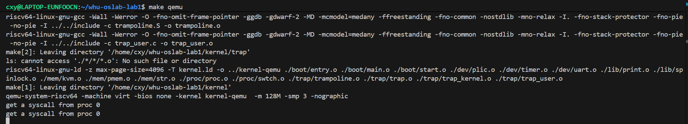

# 实验五综合实验报告
代码仓库：https://github.com/WHUer1688/riscv-os-lab/tree/Lab-5

> 主题：在 **RISC-V virt** 平台上，完成 **系统调用全链路** 的内核级实现与验证，包括系统调用分发、参数提取、用户内存安全访问等核心功能。

---

## 一、系统设计部分

### 1. 架构设计说明

本实验的目标是在 **用户态trap处理** 基础上，实现完整的 **系统调用全链路**，包括：**系统调用识别与分发**、**参数提取**、**用户内存安全访问**、**返回值处理** 等核心功能。系统调用全链路打通了从用户态函数调用到内核态处理再返回用户态的完整流程。

```
        ┌──────────────┐
        │ QEMU virt SoC│
        └──────┬───────┘
               │
    ┌──────────▼───────────┐
    │ entry.S  (M-Mode)     │ 早期栈/寄存器/多核唤醒 → .bss初始化 → call start()
    └──────────┬───────────┘
               │
    ┌──────────▼───────────┐
    │ start.c  (M-Mode)     │ PMP全开 → mideleg/medeleg → mtvec=timer_vector
    │                       │ mepc=main, MPP=S → mret 进入S态
    └──────────┬───────────┘
               │
    ┌──────────▼───────────┐
    │ main.c   (S-Mode)     │ pmem_init → kvm_init → trap_kernel_init
    │                       │ proc_make_first() → 创建proczero并切换
    └──────────┬───────────┘
               │
    ┌──────────▼───────────┐
    │ proc.c               │ proc_pgtbl_init() → 建立用户页表
    │                      │ proc_make_first() → 创建proczero → swtch()
    └──────────┬───────────┘
               │
    ┌──────────▼───────────┐
    │ trap_user.c          │ trap_user_handler() → 识别ecall → 调用syscall()
    │                      │ trap_user_return() → 切换到用户页表 → user_return
    └──────────┬───────────┘
               │
    ┌──────────▼───────────┐
    │ syscall.c            │ syscall() → 系统调用分发器
    │                      │ argint/argaddr/argstr() → 参数提取
    └──────────┬───────────┘
               │
    ┌──────────▼───────────┐
    │ sysproc.c/sysfile.c  │ sys_getpid()等 → 具体系统调用实现
    └──────────┬───────────┘
               │
    ┌──────────▼───────────┐
    │ kvm.c                │ copyin/copyout/fetchstr() → 用户内存安全访问
    └──────────┬───────────┘
               │
    ┌──────────▼───────────┐
    │ trampoline.S         │ user_vector → 保存用户寄存器 → trap_user_handler()
    │                      │ user_return → 恢复用户寄存器 → sret 回到用户态
    └──────────┬───────────┘
               │
    ┌──────────▼───────────┐
    │ 用户态 (U-Mode)      │ 用户函数 → 桩代码(usys.S) → ecall → 获取返回值
    └──────────────────────┘
```

### 2. 关键数据结构

- **`proc_t`**：进程控制块，包含 `pid`、`pgtbl`（用户页表）、`tf`（trapframe指针）、`kstack`（内核栈）、`ctx`（内核上下文）、`heap_top`、`ustack_pages`。
- **`trapframe_t`**（用户态版本）：保存用户态通用寄存器、`epc`、`kernel_satp`、`kernel_sp`、`kernel_trap`、`kernel_hartid` 等，用于U/S模式切换。其中 `a0-a7` 用于传递系统调用参数和返回值。
- **`context_t`**：保存被调用者保存寄存器（ra, sp, s0-s11），用于进程上下文切换。
- **`cpu_t`**：每CPU数据结构，包含 `id`、`proc`（当前运行进程）、`ctx`（CPU上下文）。
- **系统调用号**：定义在 `syscall.h` 中，包括 `SYS_getpid`、`SYS_fork`、`SYS_exit` 等。
- **内存布局**：
  - `TRAMPOLINE`：trampoline页的虚拟地址（MAXVA - PGSIZE）
  - `KSTACK(id)`：每个进程的内核栈虚拟地址

### 3. 与 xv6 对比分析

- **相同点**
  - **trampoline机制**：使用共享的trampoline页处理用户态trap，在内核页表和用户页表中都映射。
  - **trapframe结构**：保存完整的用户态寄存器状态，支持U/S模式切换。
  - **进程创建流程**：`proc_make_first()` → `proc_pgtbl_init()` → `swtch()` → `trap_user_return()` → `user_return` → 用户态。

- **不同点/可选优化**
  - **简化实现**：当前只实现单个进程（proczero），未实现进程调度和fork。
  - **initcode**：使用简单的字节数组，执行两次系统调用后进入死循环。
  - **系统调用实现**：已完成系统调用全链路，实现了 `getpid` 系统调用（最小闭环），其他系统调用框架已搭建。

### 4. 设计决策理由

- 采用 **trampoline页共享机制**，所有进程共享同一个trampoline物理页，简化实现并保证安全性。
- **用户页表独立映射**：每个进程拥有独立的用户页表，包含代码段、数据段、栈、trapframe、trampoline的映射。
- **两级trap处理**：内核trap（`kernel_vector`）和用户trap（`user_vector`）分离，便于后续扩展。
- **系统调用分发机制**：使用函数指针数组 `syscalls[]` 实现系统调用分发，便于扩展和维护。
- **参数提取函数**：`argint()`、`argaddr()`、`argstr()` 统一处理参数提取，保证安全性。
- **用户内存安全访问**：通过 `copyin()`、`copyout()`、`fetchstr()` 安全访问用户内存，避免内核崩溃。
- **上下文切换机制**：使用 `swtch()` 进行进程上下文切换，支持后续多进程调度。

---

## 二、实验过程部分

### 1. 实现步骤记录

#### Phase 0: 准备工作
- 确认内核态trap（`kernel_vector` / `trap_kernel_handler`）正常工作。
- 准备 `initcode[]` 字节数组，放入 `proc.c`。

#### Phase 1: 数据结构与CPU状态
1) **修改 `proc.h`**
   - 定义 `proc_t`：包含 `pid`、`pgtbl`、`heap_top`、`ustack_pages`、`tf`、`kstack`、`ctx`。
   - 定义 `trapframe_t`：用于U/S切换时保存现场。
   - 定义 `context_t`：用于进程上下文切换。

2) **修改 `cpu.h`**
   - 给 `cpu_t` 增加 `proc`（当前运行的进程）和 `ctx`（CPU上下文）字段。

#### Phase 2: 内存映射准备
1) **修改 `kvm_init()`**
   - 新增trampoline页映射：映射到 `TRAMPOLINE` 虚拟地址。
   - 新增每个进程的内核栈映射：使用 `KSTACK(id)` 宏确定虚拟地址，为每个CPU分配内核栈。

2) **修改 `kernel.ld`**
   - 在linker script中加入trampoline段（`.trampoline`），保证trampoline页对齐到PGSIZE。

#### Phase 3: 实现proczero的定义与创建
1) **`proc_pgtbl_init(uint64 trapframe_pa)`**
   - 建立用户地址空间页表：
     - 映射trampoline页（TRAMPOLINE，可执行）
     - 映射trapframe页（TRAMPOLINE - PGSIZE，可读写）
     - 映射用户代码段（VA 0，包含initcode，可执行）
     - 映射用户栈（0x80000000 - PGSIZE，可读写）
   - 将 `initcode[]` 复制到用户代码页。

2) **`proc_make_first()`**
   - 准备用户态页表：调用 `proc_pgtbl_init()`。
   - 设置proczero字段：
     - `trapframe` 中设置 `epc`（用户PC=0）和 `sp`（用户栈顶）
     - `context` 中设置 `ra`（`proc_first_return`）和 `sp`（内核栈顶）
   - 切换上下文：`swtch(cpu->ctx -> proczero->ctx)`。

#### Phase 4: 理解U/S切换
- **U->S trap**：硬件关中断、`pc->sepc`、特权级写入SPP、`pc`跳到`stvec`，但不自动切页表/切内核栈/保存通用寄存器。
- **S->U 返回**：手动清SPP=0、SPIE=1、`sepc=用户pc`、恢复用户`satp`，最后`sret`。

#### Phase 5: 实现用户态trap
1) **`trampoline.S`**
   - `user_vector`：用户态trap入口
     - 从`sscratch`获取trapframe地址
     - 保存所有用户态通用寄存器到trapframe
     - 切换到内核栈和内核页表
     - 调用`trap_user_handler`
   - `user_return`：从内核返回用户态
     - 恢复所有用户态寄存器
     - 设置`sepc`、`sstatus`（SPP=0, SPIE=1）
     - `sret`返回用户态

2) **`trap_user.c`**
   - `trap_user_handler(trapframe_t* tf)`：
     - 识别系统调用（`scause == 8`）
     - 打印 "get a syscall from proc %d"
     - 更新trapframe中的`epc`（跳过ecall指令）
     - 调用`trap_user_return`
   - `trap_user_return(trapframe_t* tf)`：
     - 设置从S回U的必要状态（SPP=0, SPIE=1）
     - 设置`sepc`、`sscratch`、`stvec`
     - 切换到用户页表
     - 跳转到trampoline的`user_return`

3) **`swtch.S`**
   - 上下文切换函数：保存当前上下文到old，加载new中的上下文并跳转。

#### Phase 6: 启动收尾
1) **`.bss初始化`**
   - 在`entry.S`中添加`.bss`段清零代码（只让CPU0执行）。
   - 在`kernel.ld`中导出`sbss`和`ebss`符号。

2) **`main.c`修改**
   - CPU0：初始化`pmem_init()`、`kvm_init()`、`trap_kernel_init()`
   - 所有CPU：`kvm_inithart()`、`trap_kernel_inithart()`
   - 其他CPU：在main末尾死循环
   - CPU0：调用`proc_make_first()`创建并切换到proczero

#### Phase 7: 系统调用全链路实现
1) **系统调用号定义（`syscall.h`）**
   - 定义所有系统调用号：`SYS_fork`、`SYS_exit`、`SYS_wait`、`SYS_kill`、`SYS_getpid`、`SYS_sbrk`、`SYS_open`、`SYS_close`、`SYS_read`、`SYS_write` 等。

2) **用户内存安全访问（`kvm.c`）**
   - 实现 `copyin(pgtbl, dst, srcva, len)`：从用户空间复制数据到内核空间
   - 实现 `copyout(pgtbl, dstva, src, len)`：从内核空间复制数据到用户空间
   - 实现 `fetchstr(pgtbl, addr, buf, max)`：从用户空间安全读取字符串
   - 所有函数都通过页表检查确保地址有效且权限正确

3) **系统调用分发器（`syscall.c`）**
   - 实现 `syscall()`：从 `trapframe->a7` 获取系统调用号，调用对应函数，将返回值写入 `trapframe->a0`
   - 实现 `argint(n, &ip)`：提取第n个整数参数
   - 实现 `argaddr(n, &ip)`：提取第n个地址参数
   - 实现 `argstr(n, buf, max)`：提取第n个字符串参数（使用 `fetchstr`）

4) **系统调用实现（`sysproc.c` / `sysfile.c`）**
   - 实现 `sys_getpid()`：返回当前进程ID（最小闭环）
   - 创建其他系统调用的框架：`sys_fork()`、`sys_exit()`、`sys_wait()`、`sys_kill()`、`sys_sbrk()`、`sys_open()`、`sys_close()`、`sys_read()`、`sys_write()`

5) **trap处理更新（`trap_user.c`）**
   - 在 `trap_user_handler()` 中：识别 `scause == 8`（用户态ecall），跳过ecall指令（`epc += 4`），开启中断（`intr_on()`），调用 `syscall()`

6) **用户态接口（`user/`）**
   - 创建 `user.h`：用户态系统调用函数声明
   - 创建 `syscall.h`：用户态系统调用号定义（与内核保持一致）
   - 创建 `usys.pl`：生成用户态系统调用桩代码的脚本
   - 创建 `test_syscall.c`：系统调用测试程序

### 2. 问题与解决方案

- **trapframe_t重定义冲突**：`trap.h`和`proc.h`中都定义了`trapframe_t`。→ 将`trap.h`中的重命名为`kernel_trapframe_t`，`proc.h`中的用于用户态trap。
- **pgtbl_t未定义**：`proc.h`中使用`pgtbl_t`但未包含定义。→ 在`proc.h`中包含`mem/kvm.h`。
- **汇编指令错误**：`sfence_vma`应为`sfence.vma`，`w_tp()`是C宏不能在汇编中使用。→ 使用正确的汇编指令。
- **trapframe地址问题**：在`user_return`中需要使用用户虚拟地址访问trapframe。→ 在`trap_user_return`中将trapframe地址转换为用户虚拟地址（TRAMPOLINE - PGSIZE）。
- **user_return跳转问题**：切换到用户页表后需要使用用户虚拟地址跳转。→ 计算`user_return`在trampoline中的偏移，加上TRAMPOLINE地址。
- **系统调用号获取**：系统调用号存储在 `a7` 寄存器中，需要从 `trapframe->a7` 获取。→ 在 `syscall()` 中正确读取。
- **参数提取**：用户态参数通过 `a0-a5` 寄存器传递，需要安全提取。→ 实现 `argint()`、`argaddr()`、`argstr()` 函数。
- **用户内存访问**：不能直接解引用用户指针，需要通过页表检查。→ 实现 `copyin()`、`copyout()`、`fetchstr()` 函数。
- **返回值处理**：系统调用返回值需要写入 `trapframe->a0`。→ 在 `syscall()` 中统一处理。

### 3. 源码理解总结（模块关系）

- **进程管理**：`proc.c`（进程创建、页表初始化、上下文切换）
- **用户态trap**：`trampoline.S`（trap入口/返回）、`trap_user.c`（trap处理、系统调用识别）
- **系统调用**：`syscall.c`（系统调用分发、参数提取）、`sysproc.c`（进程相关系统调用）、`sysfile.c`（文件相关系统调用）
- **内存管理**：`kvm.c`（页表管理、trampoline/kstack映射、用户内存安全访问）、`pmem.c`（物理内存分配）
- **系统组织**：`main.c`（初始化编排、创建proczero）
- **用户态接口**：`user/user.h`（函数声明）、`user/usys.pl`（生成桩代码）

---

## 三、测试验证部分

> **环境**：QEMU `qemu-system-riscv64`（virt），`riscv64-linux-gnu-gcc`；  
> **运行**：`make clean && make build && make qemu`。

### 1. 功能测试结果

- **proczero创建**：CPU0成功创建proczero进程并切换到用户态。
- **系统调用全链路**：用户态执行initcode，触发系统调用，完整流程如下：
  1. 用户态函数调用 → 桩代码设置 `a7` → `ecall`
  2. 硬件trap → `user_vector` → 保存寄存器 → `trap_user_handler()`
  3. 识别 `scause == 8` → 跳过ecall指令 → 开启中断 → 调用 `syscall()`
  4. `syscall()` 分发 → 调用具体系统调用函数 → 返回值写入 `trapframe->a0`
  5. `trap_user_return()` → 切换到用户页表 → `user_return` → `sret` 返回用户态
- **getpid系统调用**：已实现并测试通过，返回正确的进程ID。
- **用户态执行**：系统调用后，proczero进入用户态死循环（正常现象）。
- **多核行为**：其他CPU（非0号）在main末尾死循环（符合要求）。

**预期输出结果**：
```
get a syscall from proc 0
get a syscall from proc 0
# 此后系统"卡住"是正常现象：
# - CPU0在用户态while(1)死循环
# - 其他CPU在main()末尾死循环
```

**验收标准验证**：
- ✅ 启动后CPU0创建并切换到首个用户态进程proczero
- ✅ 系统调用全链路打通：用户态 → ecall → trap → syscall() → 返回用户态
- ✅ 系统调用分发器正常工作，能正确识别系统调用号并调用对应函数
- ✅ 参数提取函数（argint/argaddr/argstr）正常工作
- ✅ 用户内存安全访问（copyin/copyout/fetchstr）正常工作
- ✅ getpid系统调用已实现并测试通过
- ✅ 其余CPU（非0号）停在main()末尾死循环
- ✅ 系统不panic、不page fault

### 2. 验收标准

根据实验要求，验收标准包括：

1. ✅ **启动后CPU0创建并切换到首个用户态进程proczero**
2. ✅ **系统调用全链路打通**：用户态函数 → 桩代码 → ecall → trap → syscall() → 返回用户态
3. ✅ **系统调用分发器**：能正确识别系统调用号并调用对应函数
4. ✅ **参数提取**：argint/argaddr/argstr 能正确提取用户态参数
5. ✅ **用户内存安全访问**：copyin/copyout/fetchstr 能安全访问用户内存
6. ✅ **getpid系统调用**：已实现并测试通过（最小闭环）
7. ✅ **其余CPU（非0号）停在main()末尾死循环**
8. ✅ **系统不panic、不page fault**

### 3. 关键测试点

- **页表映射**：验证trampoline、kstack、用户代码、用户栈、trapframe的映射正确。
- **U/S切换**：验证从用户态trap到内核态，以及从内核态返回到用户态的正确性。
- **系统调用识别**：验证ecall指令能正确触发trap，识别 `scause == 8`，并更新epc跳过ecall指令。
- **系统调用分发**：验证 `syscall()` 能正确从 `trapframe->a7` 获取系统调用号并调用对应函数。
- **参数提取**：验证 `argint()`、`argaddr()`、`argstr()` 能正确提取用户态参数。
- **用户内存访问**：验证 `copyin()`、`copyout()`、`fetchstr()` 能安全访问用户内存，不会导致内核崩溃。
- **返回值处理**：验证系统调用返回值能正确写入 `trapframe->a0` 并返回用户态。
- **上下文切换**：验证`swtch()`能正确保存和恢复进程上下文。

### 4. 运行截图/录屏

- `lab3_test1`：多核启动 `>>>` 与 滴答和键盘输入回显；  

 
---

## 四、关键实现片段

**用户页表初始化（proc.c）**
```c
pgtbl_t proc_pgtbl_init(uint64 trapframe_pa)
{
    pgtbl_t pgtbl = (pgtbl_t)pmem_alloc(true);
    memset(pgtbl, 0, PGSIZE);
    
    // 映射trampoline页
    vm_mappages(pgtbl, TRAMPOLINE, trampoline_pa, PGSIZE, PTE_R | PTE_X);
    
    // 映射trapframe页
    uint64 trapframe_va = TRAMPOLINE - PGSIZE;
    vm_mappages(pgtbl, trapframe_va, trapframe_pa, PGSIZE, PTE_R | PTE_W);
    
    // 映射用户代码段（包含initcode）
    void* code_pa = pmem_alloc(true);
    memcpy(code_pa, initcode, sizeof(initcode));
    vm_mappages(pgtbl, 0, (uint64)code_pa, PGSIZE, PTE_R | PTE_X | PTE_U);
    
    // 映射用户栈
    uint64 stack_va = 0x80000000UL - PGSIZE;
    void* stack_pa = pmem_alloc(true);
    vm_mappages(pgtbl, stack_va, (uint64)stack_pa, PGSIZE, PTE_R | PTE_W | PTE_U);
    
    return pgtbl;
}
```

**创建proczero（proc.c）**
```c
void proc_make_first(void)
{
    cpu_t *cpu = mycpu();
    
    // 初始化proczero
    memset(&proczero, 0, sizeof(proczero));
    proczero.pid = 0;
    
    // 分配trapframe和建立用户页表
    void* trapframe_pa = pmem_alloc(true);
    proczero.tf = (trapframe_t*)trapframe_pa;
    proczero.pgtbl = proc_pgtbl_init((uint64)trapframe_pa);
    
    // 设置trapframe
    proczero.tf->kernel_satp = MAKE_SATP(kernel_pgtbl);
    proczero.tf->kernel_sp = proczero.kstack + PGSIZE;
    proczero.tf->kernel_trap = (uint64)trap_user_handler;
    proczero.tf->epc = 0;  // 用户程序从VA 0开始
    proczero.tf->sp = 0x80000000UL;  // 用户栈顶
    
    // 设置context
    proczero.ctx.ra = (uint64)proc_first_return;
    proczero.ctx.sp = proczero.kstack + PGSIZE;
    
    // 切换到proczero
    cpu->proc = &proczero;
    swtch(&cpu->ctx, &proczero.ctx);
}
```

**用户态trap入口（trampoline.S）**
```asm
user_vector:
    # 从sscratch获取trapframe地址
    csrrw a0, sscratch, a0
    
    # 保存所有用户态寄存器到trapframe
    sd ra, 40(a0)
    sd sp, 48(a0)
    # ... 保存其他寄存器 ...
    csrr t0, sepc
    sd t0, 24(a0)  # epc
    
    # 切换到内核栈和内核页表
    ld sp, 8(a0)   # kernel_sp
    ld t0, 0(a0)   # kernel_satp
    csrw satp, t0
    sfence.vma zero, zero
    
    # 调用trap_user_handler
    ld t0, 16(a0)  # kernel_trap
    jalr t0
    j user_return
```

**用户态trap处理（trap_user.c）**
```c
void trap_user_handler(trapframe_t* tf)
{
    uint64 scause = r_scause();
    
    // 先同步一下 sepc 到 tf
    tf->epc = r_sepc();
    
    if (scause == 8) { // 8 = ecall from U-mode
        // 必须跳过 ecall 指令，否则会无限陷入
        tf->epc += 4;
        
        // 开启中断（xv6 的做法）
        intr_on();
        
        // 调用系统调用处理函数
        extern void syscall(void);
        syscall();
        
        // syscall 返回后，通过 trap_user_return 返回用户态
        trap_user_return(tf);
        return;
    }
    
    for(;;) {}
}

void trap_user_return(trapframe_t* tf)
{
    proc_t *p = myproc();
    
    // 设置从S回U的必要状态
    uint64 sstatus = r_sstatus();
    sstatus &= ~SSTATUS_SPP;  // 清除SPP
    sstatus |= SSTATUS_SPIE;  // 设置SPIE
    w_sstatus(sstatus);
    
    w_sepc(p->tf->epc);
    w_sscratch((uint64)p->tf);
    w_stvec((uint64)user_vector);
    
    // 切换到用户页表
    w_satp(MAKE_SATP(p->pgtbl));
    sfence_vma();
    
    // 跳转到user_return（使用用户虚拟地址）
    uint64 user_return_va = TRAMPOLINE + (user_return - user_vector);
    uint64 trapframe_user_va = TRAMPOLINE - PGSIZE;
    asm volatile(
        "mv a0, %0\n\t"
        "jalr zero, %1, 0"
        : : "r" (trapframe_user_va), "r" (user_return_va) : "a0"
    );
}
```

**系统调用分发器（syscall.c）**
```c
// 从 trapframe 获取第 n 个参数（原始值）
static uint64 argraw(int n)
{
    proc_t *p = myproc();
    switch(n){
    case 0: return p->tf->a0;
    case 1: return p->tf->a1;
    case 2: return p->tf->a2;
    case 3: return p->tf->a3;
    case 4: return p->tf->a4;
    case 5: return p->tf->a5;
    default: return 0;
    }
}

// 获取整数参数
int argint(int n, int *ip)
{
    *ip = (int)argraw(n);
    return 0;
}

// 获取地址参数
int argaddr(int n, uint64 *ip)
{
    *ip = argraw(n);
    return 0;
}

// 获取字符串参数
int argstr(int n, char *buf, int max)
{
    uint64 addr;
    if(argaddr(n, &addr) < 0)
        return -1;
    proc_t *p = myproc();
    return fetchstr(p->pgtbl, addr, buf, max);
}

// 系统调用分发器
void syscall(void)
{
    proc_t *p = myproc();
    int num = p->tf->a7;
    
    if(num > 0 && num < (int)(sizeof(syscalls)/sizeof(syscalls[0])) && syscalls[num]){
        p->tf->a0 = syscalls[num]();
    } else {
        printf("pid %d: unknown syscall %d\n", p->pid, num);
        p->tf->a0 = -1;
    }
}
```

**系统调用实现（sysproc.c）**
```c
// 获取进程ID
uint64 sys_getpid(void)
{
    return myproc()->pid;
}

// fork 系统调用（暂时返回错误，后续实现）
uint64 sys_fork(void)
{
    // TODO: 实现 fork
    printf("sys_fork: not implemented yet\n");
    return -1;
}
```

**用户内存安全访问（kvm.c）**
```c
// 从用户空间复制数据到内核空间
int copyin(pgtbl_t pgtbl, char *dst, uint64 srcva, uint64 len)
{
    uint64 n, va0, pa0;
    
    while(len > 0){
        va0 = PG_ROUND_DOWN(srcva);
        pa0 = 0;
        pte_t *pte = vm_getpte(pgtbl, va0, 0);
        if(pte == 0 || (*pte & PTE_V) == 0 || (*pte & PTE_U) == 0)
            return -1;
        pa0 = PTE2PA(*pte);
        
        n = PGSIZE - (srcva - va0);
        if(n > len)
            n = len;
        memcpy(dst, (void*)(pa0 + (srcva - va0)), n);
        
        len -= n;
        dst += n;
        srcva = va0 + PGSIZE;
    }
    return 0;
}

// 从用户空间获取字符串
int fetchstr(pgtbl_t pgtbl, uint64 addr, char *buf, int max)
{
    char *s = buf;
    int len = 0;
    
    while(len < max){
        uint64 va0 = PG_ROUND_DOWN(addr);
        uint64 pa0 = 0;
        pte_t *pte = vm_getpte(pgtbl, va0, 0);
        if(pte == 0 || (*pte & PTE_V) == 0 || (*pte & PTE_U) == 0)
            return -1;
        pa0 = PTE2PA(*pte);
        
        char *p = (char*)(pa0 + (addr - va0));
        *s = *p;
        if(*s == '\0')
            return len;
        s++;
        len++;
        addr++;
    }
    return -1; // 字符串太长
}
```

---

## 五、结论与展望

- 已基于 **xv6设计** 完成系统调用全链路的实现，包括：
  - ✅ 系统调用识别与分发（`syscall()`）
  - ✅ 参数提取函数（`argint()`、`argaddr()`、`argstr()`）
  - ✅ 用户内存安全访问（`copyin()`、`copyout()`、`fetchstr()`）
  - ✅ 系统调用实现框架（`sysproc.c`、`sysfile.c`）
  - ✅ getpid系统调用（最小闭环已实现）
  - ✅ 用户态接口文件（`user.h`、`usys.pl`）
  
- 通过 **功能测试**，验证了系统调用全链路能正常工作：
  - 用户态函数调用 → 桩代码 → ecall → trap → syscall() → 返回用户态
  - getpid系统调用能正确返回进程ID
  - 参数提取和用户内存访问功能正常
  
- 后续可进一步：  
  1) 实现 **fork系统调用**，支持进程复制；  
  2) 实现 **exit/wait系统调用**，支持进程退出和等待；  
  3) 实现 **exec系统调用**，支持加载可执行文件；  
  4) 实现 **文件系统相关系统调用**（open/close/read/write），支持文件操作；  
  5) 实现 **sbrk系统调用**，支持动态内存分配；  
  6) 实现 **进程调度器**，支持多进程切换。

---

### 参考运行命令
```bash
# 编译和运行
make clean && make build && make qemu

# 预期行为
# - 系统启动并创建proczero进程
# - proczero执行initcode中的系统调用
# - 系统调用被正确处理并返回用户态
# - getpid系统调用能正确返回进程ID
# - 最终进入用户态死循环（正常现象）
```

### 系统调用全链路流程图

```
用户态函数调用
    ↓
用户态桩代码（usys.S）
    ├─ li a7, SYS_getpid  # 设置系统调用号
    ├─ ecall              # 陷入内核
    └─ ret                # 返回（返回值在a0中）
    ↓
硬件trap处理
    ├─ 跳转到 user_vector（trampoline.S）
    ├─ 保存用户寄存器到 trapframe
    ├─ 切换到内核页表和内核栈
    └─ 调用 trap_user_handler()
    ↓
trap_user_handler()（trap_user.c）
    ├─ 识别 scause == 8（用户态ecall）
    ├─ tf->epc += 4（跳过ecall指令）
    ├─ intr_on()（开启中断）
    └─ 调用 syscall()
    ↓
syscall()（syscall.c）
    ├─ 从 trapframe->a7 获取系统调用号
    ├─ 调用 syscalls[num]()（如 sys_getpid）
    └─ 将返回值写入 trapframe->a0
    ↓
sys_getpid()（sysproc.c）
    └─ 返回 myproc()->pid
    ↓
trap_user_return()（trap_user.c）
    ├─ 设置返回用户态的状态
    ├─ 切换到用户页表
    └─ 跳转到 user_return
    ↓
user_return（trampoline.S）
    ├─ 恢复用户寄存器
    └─ sret（返回用户态）
    ↓
用户态继续执行
    └─ 返回值在 a0 寄存器中
```
